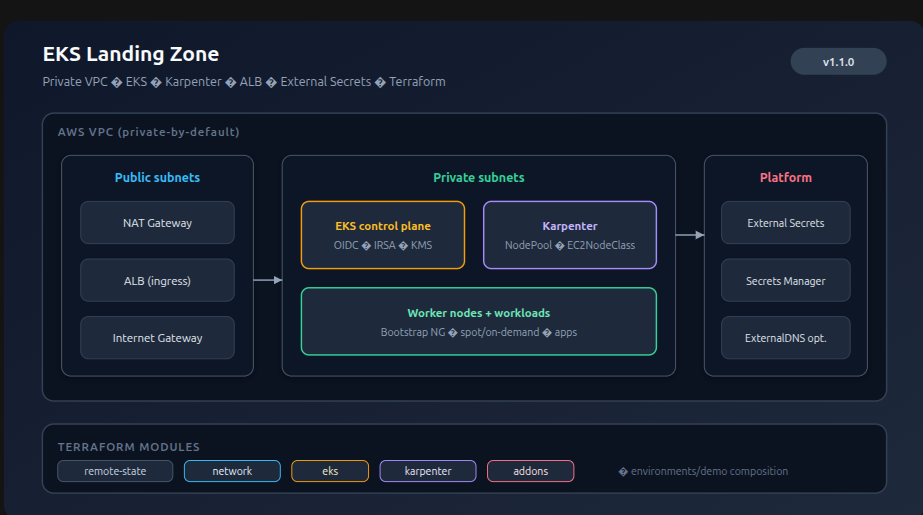

# Architecture Overview

## Intent

Reusable **AWS EKS landing zone** accelerator: a production-shaped Kubernetes platform that a team can adopt by configuration, not by rewriting core modules.

Portfolio and client reuse share the same design: private-by-default networking, managed control plane, elastic nodes via Karpenter, and a minimal add-on set for ingress, DNS, and secrets.

## System Diagram

Canonical view (same asset as the [README](../README.md) hero):

Source vector: [`architecture.svg`](./assets/architecture.svg)

Layers: public edge (NAT / ALB / IGW) → private EKS + Karpenter + nodes → platform secrets path. Footer maps each layer to a Terraform module.

## Design Principles

- **Template-first** — environment differences live in composition/vars, not forks of modules.
- **Private-by-default** — workloads and nodes in private subnets; explicit public ingress only via ALB.
- **Least privilege** — IRSA for controllers and workloads; no long-lived node credentials for AWS APIs where avoidable.
- **Elastic capacity** — Karpenter owns node lifecycle; avoid large static node groups except a thin bootstrap path if required.
- **Safe collaboration** — remote state with locking; CI validate/fmt/policy before apply.
- **Operability** — architecture, module map, and runbooks are first-class deliverables.

## Module Map

See [`module-map.md`](./module-map.md) for ownership boundaries and planned Terraform layout.

## Environment Model

| Layer | Role |
|---|---|
| `terraform/modules/*` | Reusable building blocks (inputs/outputs only; no account-specific hardcoding) |
| `terraform/environments/<env>` | Composition: wires modules for `dev` / `staging` / `prod` (or client demo) |
| Config / tfvars | CIDRs, region, cluster name, domain, tags, feature toggles |

Onboarding a new tenant or environment should mean new composition + variables, not edits inside module internals.

## Security Baseline (target)

- Encryption at rest for EKS secrets (envelope encryption with KMS) and EBS where applicable
- Restricted security groups and private API endpoint option documented per environment
- Secrets only via Secrets Manager / SSM through External Secrets — never in git
- Image and IaC scanning gates in CI (introduced in later milestones)

## Explicit Non-Goals (initial releases)

- Multi-cluster / multi-region mesh (see separate portfolio project for DR patterns)
- Full service mesh or opinionated app platform (Argo CD, Istio, etc.) — optional later
- Cost dashboards (covered by `finops-dashboard`)
- Guaranteed live AWS demo account in the public repo (docs + IaC are the product; apply is optional)

## Related Docs

- Roadmap: [`roadmap.md`](./roadmap.md)
- Config / parameter model: [`config-model.md`](./config-model.md)
- Decision log: [`decision-log/`](./decision-log/)
